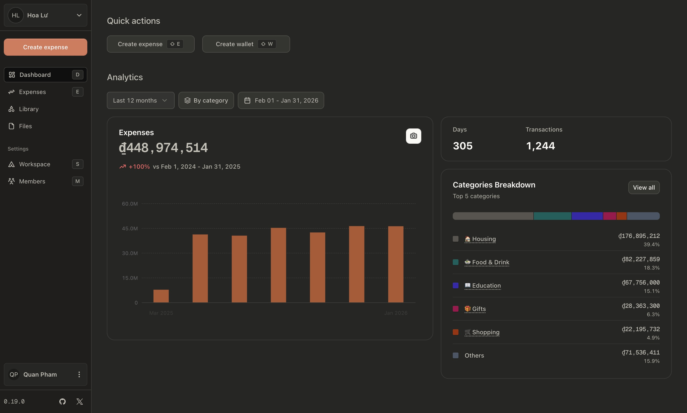

<h1 align="center">
  Hoalu
</h1>

<p align="center">
  
</p>

<p align="center">
  A modern expense tracking application built with React 19, Electric SQL, and TanStack ecosystem. Features real-time synchronization, multi-workspace support, and comprehensive analytics.
</p>

## Directories

### Apps

| Repo                   | Description |
| ---------------------- | ----------- |
| [@hoalu/api](apps/api) | Backend API |
| [@hoalu/app](apps/app) | Dashboard   |

### Packages

| Repo                                   | Description                                                                                          |
| -------------------------------------- | ---------------------------------------------------------------------------------------------------- |
| [@hoalu/common](packages/common)       | Reusable functions & constants accross workspaces                                                    |
| [@hoalu/countries](packages/countries) | Countries, Languages & Continents data - [annexare/Countries](https://github.com/annexare/Countries) |
| [@hoalu/auth](packages/auth)           | Better Auth plugins & utils                                                                          |
| [@hoalu/furnace](packages/furnace)     | Hono handlers & utils for `@hoalu/api`                                                               |
| [@hoalu/email](packages/email)         | Email templates                                                                                      |
| [@hoalu/icons](packages/icons)         | Icon library                                                                                         |
| [@hoalu/themes](packages/themes)           | Common CSS styling & available themes                                                                |
| [@hoalu/ui](packages/ui)               | [Base UI](https://base-ui.com/react/overview/quick-start)                                            |
| [@hoalu/tsconfig](packages/tsconfig)   | Typescript configurations                                                                            |

## Getting Started

```bash
# Install Bun if not already installed
curl -fsSL https://bun.sh/install | bash

# Install Caddy if not already installed (macOS)
brew install caddy

# Install dependencies
bun install

# Start local infrastructure (PostgreSQL, Redis, Electric)
bun run docker:up

# Start Caddy reverse proxy (in project root)
caddy run

# Start development (API + App)
bun dev
```
- Run `bun install` & `bun dev`

## Deployment

```sh
cd deployments
make deploy
```

`.env` is fetched from [Infisical](https://infisical.com/). Template reference at [deployments/.env.template](deployments/.env.template).

## Repo Activity


