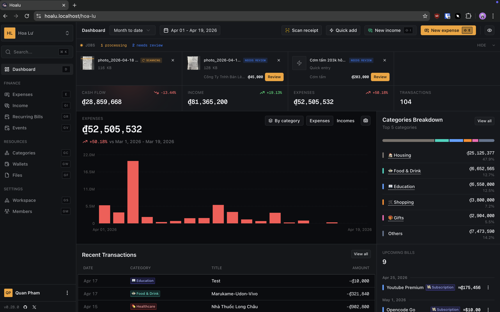

<h1 align="center">
  Hoalu
</h1>

<p align="center">
  
</p>

<p align="center">
  A modern expense tracking application built with React 19, Electric SQL, and TanStack ecosystem. Features real-time synchronization, multi-workspace support, and comprehensive analytics.
</p>

## Getting Started

```bash
# Install pnpm if not already installed
corepack enable && corepack prepare pnpm@latest --activate

# Install Caddy if not already installed (macOS)
brew install caddy

# Install dependencies
pnpm install

pnpm run docker:up
pnpm dev:apps
```

## Deployment

```sh
cd deployments
make deploy
```

`.env` is fetched from [Infisical](https://infisical.com/). Template reference at [deployments/.env.template](deployments/.env.template).

## Repo Activity


